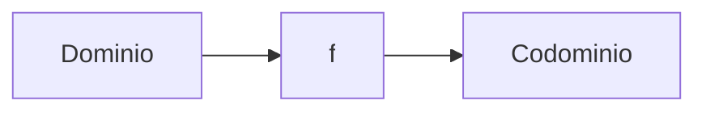

# Aprende — MVP Design Spec

**Fecha:** 2026-05-14
**Estado:** Borrador para revisión
**Autor:** Brainstorm session
**Repo:** github.com/loctime/aprende

---

## 1. Resumen ejecutivo

**Qué construimos:** una plataforma web de aprendizaje que toma cursos en video públicos (YouTube en v1) y los enriquece con material original premium (resúmenes, ejercicios con solución, diagramas, ejemplos trabajados). El video se embebe sin rehospedar; el valor agregado producido por la plataforma es el producto.

**Vertical v1:** Matemáticas.

**Visión a 12-18 meses (fuera de scope de v1):** plataforma horizontal multi-materia (math, programación, cocina, idiomas, tutoriales) con modelo freemium (algunas lecciones gratis, otras detrás de paywall, suscripción mensual).

**Por qué este enfoque:**
- **Legal/comercial:** el video público se embebe legalmente; nuestro material es 100% original y monetizable sin riesgo.
- **Diferenciación:** la mayoría de las plataformas son agregadores puros o cursos cerrados. Combinar lo mejor de YouTube con material premium genuino es un nicho con poca competencia directa.
- **Producibilidad:** con asistencia de IA + revisión humana podemos producir material de alta calidad a un costo marginal mucho menor que producir videos originales.

---

## 2. Alcance del MVP

### Incluido en v1

- **Una sola vertical:** matemáticas
- **10-15 lecciones** completas (entre 1-2 capítulos de un curso real)
- **Página de lección** con video + 4 tabs (Resumen / Ejercicios / Diagramas / Ejemplos)
- **Catálogo navegable:** Curso → Capítulo → Lección
- **Pipeline de ingesta:** script CLI que prepara transcripts + frames desde YouTube
- **Renderizado MDX:** con KaTeX (fórmulas), Mermaid (diagramas), componentes React custom (`<Ejercicio>`, `<Solucion>`, `<Ejemplo>`)
- **Deploy automático:** push a `main` → Vercel SSG → CDN
- **SEO básico:** meta tags, sitemap, OpenGraph
- **Mobile responsive:** layout se apila vertical en pantallas chicas

### Diferido (no en v1)

- Autenticación y registro de usuarios
- Sistema de pagos / suscripciones / paywall
- Tracking de progreso del usuario
- Certificados
- Otras verticales (programación, cocina, etc.)
- Ingesta de fuentes que no sean YouTube (blogs, etc.)
- Whisper para videos sin subtítulos auto
- Auto-chunking de videos largos sin chapter marks
- Admin panel para gestión de contenido
- Búsqueda full-text
- Comentarios / comunidad
- Sincronización fina por timestamp dentro de un video (tabs son estáticas por lección)

---

## 3. Arquitectura

### 3.1 Flujo build-time (producción de contenido)

```
[YouTube URL]
    ↓ (scripts/ingest.mjs)
[yt-dlp + ffmpeg]
    ↓
[drafts/<id>/]
  ├── transcript.txt
  ├── frames/*.jpg
  ├── chapters.json
  └── BRIEF.md
    ↓ (Claude lee en chat)
[content/courses/.../leccion-X/]
  ├── lesson.json
  ├── resumen.mdx
  ├── ejercicios.mdx
  ├── diagramas.mdx
  └── ejemplos.mdx
    ↓ (review humano + git commit)
[repo en GitHub]
```

### 3.2 Flujo build & deploy

```
git push origin main
    ↓
[Vercel CI]
    ↓ (next build, SSG de todas las páginas)
[Vercel CDN]
    ↓
aprende.app
```

### 3.3 Flujo runtime (usuario)

```
[Usuario abre /cursos/matematicas-i/01-funciones/01-que-es-funcion]
    ↓
[Vercel CDN sirve HTML estático]
    ↓
[Browser renderiza:]
  - YouTube iframe (embed oficial)
  - MDX → React (con KaTeX para fórmulas, Mermaid para diagramas)
  - Tabs interactivas (client-side state)
```

---

## 4. Stack técnico

| Capa | Tecnología | Por qué |
|---|---|---|
| Framework | Next.js 14+ (App Router) | SSG + SEO + ergonomía + ecosistema |
| Lenguaje | TypeScript | Tipo seguro al armar el árbol de contenido |
| Estilos | Tailwind CSS | Productividad + buenos defaults |
| Contenido | MDX | Markdown + componentes React inline |
| Math rendering | KaTeX (via `rehype-katex`) | Más rápido que MathJax, suficiente |
| Diagramas | Mermaid | Texto → diagrama, perfecto para math |
| Pipeline | Node.js + yt-dlp + ffmpeg | Estándar, gratis, sin APIs |
| Hosting | Vercel | Mejor integración con Next, ya configurado |
| Repo | GitHub: `loctime/aprende` | Ya creado |

---

## 5. Estructura del proyecto

```
aprende/
├── app/                              # Next.js App Router
│   ├── layout.tsx
│   ├── page.tsx                      # landing
│   ├── cursos/
│   │   ├── page.tsx                  # catálogo de cursos
│   │   └── [curso]/
│   │       ├── page.tsx              # detalle del curso (capítulos)
│   │       └── [capitulo]/
│   │           └── [leccion]/
│   │               └── page.tsx      # página de lección
│   └── api/                          # (vacío en v1)
├── components/
│   ├── video/
│   │   └── YouTubePlayer.tsx
│   ├── lesson/
│   │   ├── TabPanel.tsx
│   │   ├── LessonNav.tsx             # prev/next + lista capítulo
│   │   └── ChapterSidebar.tsx
│   └── mdx/                          # custom MDX components
│       ├── Ejercicio.tsx
│       ├── Solucion.tsx              # collapsible
│       ├── Ejemplo.tsx
│       ├── Formula.tsx
│       ├── Diagrama.tsx
│       └── Definicion.tsx
├── lib/
│   ├── content.ts                    # scanner del filesystem
│   ├── mdx.ts                        # config MDX + plugins
│   └── types.ts
├── content/
│   └── courses/
│       └── matematicas-i/
│           ├── course.json
│           ├── 01-funciones/
│           │   ├── chapter.json
│           │   ├── 01-que-es-una-funcion/
│           │   │   ├── lesson.json
│           │   │   ├── resumen.mdx
│           │   │   ├── ejercicios.mdx
│           │   │   ├── diagramas.mdx
│           │   │   └── ejemplos.mdx
│           │   ├── 02-dominio-y-rango/
│           │   └── ...
│           └── 02-limites/
├── public/
│   └── frames/                       # screenshots referenciados desde MDX
├── scripts/
│   ├── ingest.mjs                    # pipeline yt-dlp + ffmpeg
│   └── lib/
│       ├── youtube.mjs
│       └── frames.mjs
├── drafts/                           # outputs de ingest (gitignored)
└── docs/
    └── superpowers/
        └── specs/
            └── 2026-05-14-aprende-mvp-design.md  # este archivo
```

---

## 6. Modelo de contenido

### 6.1 Niveles

- **Curso** (`course.json`): título, descripción, nivel, imagen de portada, orden de capítulos.
- **Capítulo** (`chapter.json`): título, resumen, orden.
- **Lección** (`lesson.json` + 4 MDX): título, orden, YouTube ID, duración en segundos, timestamps inicio/fin si es un chunk de un video más largo.

### 6.2 Schema de `lesson.json`

```json
{
  "title": "¿Qué es una función?",
  "order": 1,
  "youtubeId": "Ej23GMmS8wQ",
  "startSec": 0,
  "endSec": 612,
  "durationSec": 612,
  "sourceUrl": "https://youtube.com/watch?v=Ej23GMmS8wQ",
  "sourceAttribution": "Profesor X — Canal Y",
  "freeTier": true
}
```

`startSec`/`endSec` permiten que una lección sea un chunk de un video más largo (el YouTube embed soporta `?start=X&end=Y`). `freeTier: true` en v1 es siempre `true`; cuando agreguemos paywall pasará a ser significativo.

### 6.3 Custom MDX components

```mdx
<Ejercicio dificultad="facil|medio|dificil">
  Calculá el dominio de f(x) = √(x - 2).
  <Solucion>
    El radicando debe ser ≥ 0, por lo tanto x - 2 ≥ 0 → x ≥ 2.
    **Dominio:** [2, ∞).
  </Solucion>
</Ejercicio>

<Ejemplo titulo="Ejemplo 1: función lineal">
  ...contenido paso a paso...
</Ejemplo>

<Definicion termino="función">
  Una función es una relación entre dos conjuntos...
</Definicion>

<Diagrama>

</Diagrama>

<Formula display>
  f(x) = ax^2 + bx + c
</Formula>
```

### 6.4 Scanner del filesystem

`lib/content.ts` expone:

```ts
type Course = {
  slug: string
  title: string
  description: string
  chapters: Chapter[]
}

type Chapter = { slug: string; title: string; lessons: Lesson[] }
type Lesson = { slug: string; title: string; youtubeId: string; ... }

export function getAllCourses(): Course[]
export function getCourse(slug: string): Course | null
export function getLesson(courseSlug: string, chapterSlug: string, lessonSlug: string): { meta: Lesson; tabs: { resumen: string; ejercicios: string; diagramas: string; ejemplos: string } }
```

Se llama desde `generateStaticParams()` en cada page.tsx para que Next genere todas las URLs en build time.

---

## 7. Pipeline de ingesta

### 7.1 Uso

```bash
npm run ingest -- https://youtube.com/watch?v=XXX
```

### 7.2 Lo que hace el script

1. Valida la URL.
2. Llama a `yt-dlp` para descargar:
   - Auto-subtitles en español (fallback inglés) en formato `.vtt`.
   - Lista de chapter marks (si las tiene).
   - Metadata: título, autor, duración.
3. Si no hay subtítulos auto-generados: el script imprime un warning y sale. (Whisper se agrega en v2.)
4. Convierte `.vtt` a `transcript.txt` con timestamps.
5. Llama a `ffmpeg` para extraer keyframes:
   - Si el video tiene chapter marks: un frame al inicio de cada chapter.
   - Sino: detección de cambio de escena con `select='gt(scene,0.3)'`.
   - Frames guardados como `frames/000.jpg`, `frames/001.jpg`, ...
6. Genera `BRIEF.md` con: metadata del video, transcript completo, lista de frames con timestamps.
7. Output a `drafts/<youtubeId>/`.

### 7.3 Generación del contenido MDX

Después del script, el usuario abre Claude Code y dice:
> "ingerí drafts/Ej23GMmS8wQ — curso matematicas-i, capitulo 01-funciones, leccion 01-que-es-funcion"

Claude:
1. Lee `BRIEF.md`, `transcript.txt`, y los frames más relevantes.
2. Genera los 4 archivos MDX siguiendo las convenciones de §6.3.
3. Genera `lesson.json` con la metadata correcta.
4. Copia los 1-3 frames más relevantes a `public/frames/<lessonSlug>/`.
5. Reporta al usuario los archivos creados.

El usuario revisa, ajusta, commitea.

---

## 8. Componentes UI clave

### 8.1 Página de lección (`app/cursos/[curso]/[capitulo]/[leccion]/page.tsx`)

Layout:
- **Header**: breadcrumb (Curso > Capítulo > Lección) + botón "← Capítulo".
- **Main grid** (desktop ≥ 1024px): video izquierda (60%) + tabs derecha (40%). En mobile: se apilan vertical.
- **Video**: `<YouTubePlayer>` con embed oficial, autoplay off, sin sugerencias relacionadas (`rel=0`).
- **Tabs**: 4 botones (Resumen / Ejercicios / Diagramas / Ejemplos). Estado client-side. Por defecto: Resumen.
- **Footer de lección**: navegación prev/next dentro del capítulo.

### 8.2 `<TabPanel>`

Recibe 4 strings de MDX compilado. Renderiza el activo. Tabs accesibles (`role="tablist"`, keyboard nav).

### 8.3 `<Ejercicio>` y `<Solucion>`

`<Solucion>` es un `<details>` colapsable. Por defecto cerrado. El usuario lo abre cuando quiere ver la respuesta.

### 8.4 `<YouTubePlayer>`

Wrapper sobre el iframe oficial. Acepta `videoId`, `startSec`, `endSec`. Lazy-loaded (no carga el iframe hasta que el usuario hace click en un poster con thumbnail). Beneficios:
- **Performance:** no se descarga el player de YouTube hasta que se necesita → carga inicial mucho más rápida.
- **Menos cookies de terceros:** YouTube no se inyecta hasta interacción explícita del usuario. (Cuando agreguemos paywall/cuentas, evaluaremos si necesitamos un banner de consentimiento formal según el público objetivo.)

---

## 9. Calidad y "definition of done" para v1

Para considerar v1 listo para mostrar a usuarios reales:

- [ ] 10 lecciones completas con los 4 tabs cada una, contenido revisado humanamente
- [ ] Página de lección con layout A funcionando en desktop y mobile
- [ ] Catálogo (lista de cursos → capítulos → lecciones) navegable
- [ ] Pipeline `npm run ingest` funcional con un video real
- [ ] Build estático completo deploya a Vercel en < 2 min
- [ ] Lighthouse score: Performance > 90, Accessibility > 90, SEO > 95
- [ ] Mobile usable (no horizontal scroll, video se ve bien, tabs alcanzables)
- [ ] Sitemap.xml generado
- [ ] OpenGraph + Twitter cards en cada página de lección
- [ ] Atribución visible al creador original en cada lección (nombre del canal de YouTube)

---

## 10. Aproximación de testing

V1 prioriza velocidad sobre coverage exhaustivo. Testing mínimo pragmático:

- **Unit tests** (`vitest`): el scanner de contenido (`lib/content.ts`), parseo de `lesson.json`, lógica de los componentes MDX.
- **Snapshot/visual** (manual): screenshots de cada lección en mobile + desktop antes de deploy.
- **E2E manual** (lista de verificación):
  - Cargar la home → ver catálogo → click curso → click capítulo → click lección → ver video + tabs.
  - Cambiar de tab (los 4) → verificar contenido renderizado.
  - Abrir/cerrar `<Solucion>`.
  - Navegación prev/next.
- **Lighthouse en CI** (Vercel previews): para garantizar perf/SEO/a11y.

No agregamos tests E2E automatizados (Playwright/Cypress) en v1 — el costo de mantenimiento no se justifica con el catálogo todavía chico.

---

## 11. Consideraciones futuras (NO en v1, documentadas para que el código esté preparado)

- **Auth + paywall**: agregaremos NextAuth + Stripe cuando haya tracción. El flag `freeTier` en `lesson.json` ya existe para marcar lecciones premium.
- **Progress tracking**: cuando agreguemos auth, también una DB (Neon/Supabase) para tracking de lecciones vistas, ejercicios resueltos.
- **Búsqueda**: cuando el catálogo supere 50 lecciones, agregar búsqueda full-text con Algolia o Pagefind.
- **Otras verticales**: el modelo de contenido es genérico, suma de verticales = sumar carpetas en `content/courses/`. Componentes específicos por vertical (ej: `<Receta>` para cocina) se sumarán según necesidad.
- **Otras fuentes**: para blogs, extenderemos `scripts/ingest.mjs` con un nuevo módulo `scripts/lib/blog.mjs` que use Readability + extracción de imágenes.
- **Auto-chunking**: cuando haga falta, agregamos un comando para sub-dividir un video largo basándose en pausas naturales del transcript.
- **Generación batch / API**: si crece la demanda de ingesta, agregaremos integración con Claude API para procesar múltiples lecciones en paralelo. Costo se sumará a la planificación.

---

## 12. Riesgos identificados

| Riesgo | Mitigación |
|---|---|
| Creador de YouTube revoca permiso de embed | Atribuir claramente; tener un proceso de takedown manual |
| Calidad del transcript auto-generado pobre | Revisión humana de cada MDX antes de commit |
| Material generado por IA con errores matemáticos | Cada ejercicio se revisa contra el video original |
| Costos de Vercel si crece tráfico | Plan free aguanta mucho; cuando crezca, agregamos cache headers y reviewamos |
| Curva de aprendizaje del usuario con el layout | Validar con 5-10 usuarios reales antes de invertir en más contenido |
